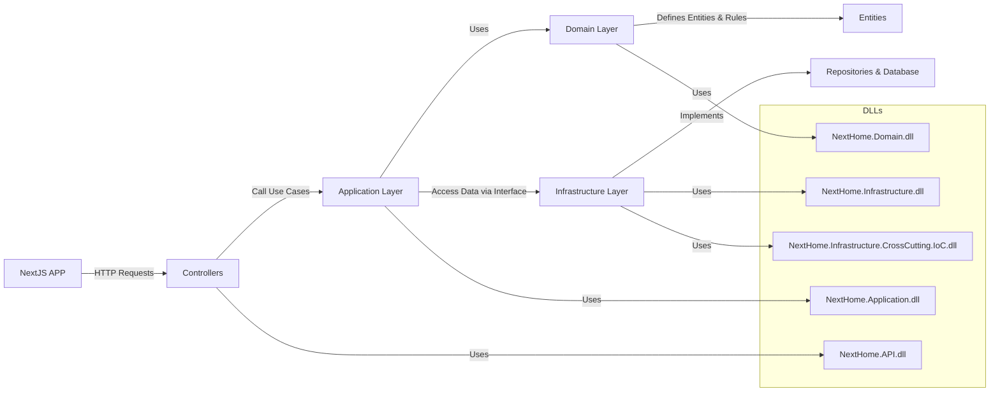

# Next Home

## 📌 Sobre o Projeto
O **Next Home** é uma aplicação para **locação e venda de imóveis**, focando em **alta indexação** em motores de busca (**SEO**) e **arquitetura escalável**. O projeto é construído seguindo os princípios da **Clean Architecture**, garantindo modularidade, testabilidade e fácil manutenção.

## 🚀 Tecnologias Utilizadas
- **Frontend**: Next.js (React)
- **Backend**: .NET Core com C#
- **Banco de Dados**: SQL Server
- **Autenticação**: Keycloak
- **ORM**: Dapper
- **Validações**: FluentValidation
- **Injeção de Dependências**: Microsoft.Extensions.DependencyInjection
- **Versionamento**: Git

## 🔍 Arquitetura do Projeto
A arquitetura do **Next Home** segue a **Clean Architecture**, separando responsabilidades e garantindo baixo acoplamento.

